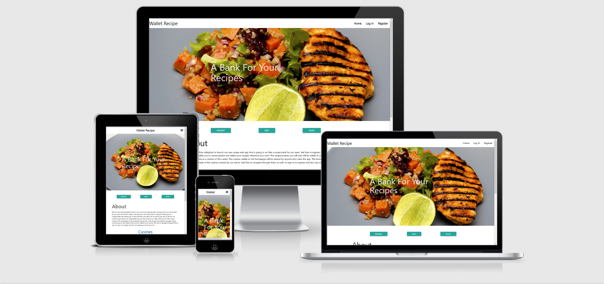

# Web and Mobile Recipe app. 

## Introduction

Welcome to my third milestone project. This project is a recipe web and mobile app that involves programming languages such as HTML5, CSS3, JavaScript and Python.
This app will demonstrate how all the above languages are used to showcase their excellence in delivering good product to the user from backend to frontend.

A live website can be found [here](https://flask-cusine3.herokuapp.com/).

# Table of Contents

-   [1. UX](#ux)
    -   [1.1. Strategy](#strategy)
        -   [Project Goals](#project-goals)
            -   [User Goals:](#user-goals)
            -   [User Expectations:](#user-expectations)
            -   [Trends of Modern Websites](#trends-of-modern-websites)
            -   [Strategy Table](#strategy-table)
    -   [1.2. Structure](#structure)
    -   [1.3. Skeleton](#skeleton)
    -   [1.4. Surface](#surface)
-   [2. Features](#features)
-   [3. Technologies Used](#technologies-used)
-   [4. Testing](#testing)
-   [5. Development Cycle](#development-cycle)
-   [6. Deployment](#deployment)
-   [7. End Product](#end-product)
-   [8. Known Bugs](#known-bugs)
-   [9. Credits](#credits)

# 1. UX

[Go to the top](#table-of-contents)

We all have that one part of ourselves that is drawned in food specialities even though not all of us are foodies but deep down us food motivates us in all kinds of ways.
The app has simple and navigable features to all users and non users.

## 1.1. Strategy

[Go to the top](#table-of-contents)

### Project Goals

The goal of this app is to not just target those in need of the recipes to make their quick dinner but it allows users to share their own personal dishes with others.
The app gives a registered user full potetial to create,update and delete the recipe whenever they please with less complications.
The app acts as storage of personal recipes or sharing to the users.

### User Goals:

First Time Visitor Goals
-   As a first-time visitor, I want to be engaged with the concept of the app.
-   As a first-time visitor, I want to be able to easily understand what the app is about.
-   As a first-time visitor, I want to see what others have shared.
-    As a first-time visitor, I want to have less complication on registering.

Returning Visitor Goals
-   As a Returning Visitor, I want toedit and delete the data I created.
-   As a Returning Visitor, I want to share more recipes with other users.
-    As a Returning Visitor, I want to update my archived date/recipes

Frequent User Goals
-   As a Frequent User, I want to check to see if there are any newly updates on the categories.
-   As a Frequent User, I want to check if more recipes are added or updated by users.

### User Expectations:

The game should be engaging and display a winner or loose feedback to the player.

-   The game difficulty selection is clear.
-   The user interface is easy to navigate.
-   The game is responsive on all devices including mobile, tablet and desktop.
-   To have the ability to contact the creator of the game.

### Trends of modern games:

-   Mobile gaming (gaming on the go)
-   Nostalgia gaming with remastered games

### Strategy Table

| Opportunity/Problem/Feature              | Importance | Viability/Feasibility |
| ---------------------------------------- | ---------- | --------------------- |
| Engaging game play                       | 5          | 5                     |
| Time tracking system                     | 5          | 5                     |
| The ability to chose the levels prefered | 5          | 5                     |
| Responsive design                        | 5          | 4                     |
| Contact/Open form                        | 4          | 5                     |
| Rules popup modal                        | 5          | 5                     |
| Caption for the loose div                | 5          | 5                     |
| Caption for the winning div              | 2          | 1                     |
| Total                                    | 36         | 35                    |

## Scope

As I labelled a couple of features from the strategy table. I will phase this project in multiple phases. Phase 1 will be what I have identified as a minimum viable product. Please find below the plans I have for each phase.

### Phase 1

-   Engaging game play
-   The time track countdown
-   The ability to pick the game level
-   Responsive design
-   Contact form
-   Instruction's popup modal
-   The card matching

### Phase 2

-   Caption for the win game with a pop up div congratulating a player for the good effort they have made to win.
-   Caption for the loose game with a pop up div extending my misery to the player for the loose despite their hard work on trying to win.

## 1.2. Structure

[Go to the top](#table-of-contents)

It is really important to include responsive design in this project as many users are using different devices (mobile, tablet, laptop/PC). This gives the user the best experience on their device.

-   Responsive on all device sizes
-   Easy navigation through labelled buttons
-   Footer at the bottom of the index page that links to the social media website.
-   All elements will be consistent including font size, font family, colour scheme.

## 1.3. Skeleton

[Go to the top](#table-of-contents)

I used [Balsamiq](https://balsamiq.com/) to create my wireframes as this gives the template of the UI. This also shows where all elements will be placed within the screen.

There are 3 versions of the overall design of the project with the wireframe as the first one shows the design on a web browser wehn all the main three home page buttons are clicked and this responds to all screen displays, second one shows the game on runtime after the user as cliked a "Start Gmae" button and has chosen the game level. The thired one other shows a mobile browser format but displaying how the home page reviews when neither of the three buttons are clicked. Both have a commenton a yellow note explaining the previews present.

### Wire-frames

Web browser index page (When the home page buttons are cliked):
[

Web browser index page (When the "Start Game"button as been clicked and the game is on run time):
[

Mobile index page:
[

## 1.4. Surface

[Go to the top](#table-of-contents)

### Colours

Please find the colours schemes that I used [here](https://coolors.co/f0ffff-0085c7-df0024-f4c300-009f3d).

### Typography

I decided to use Roboto as my font of choice with sans serif as my backup font for browsers that might not support Roboto.

# 2. Features

[Go to the top](#table-of-contents)

### All Pages

-   Clickable buttons are placed at the vertically from top top to mid-center of the page.
-   Image background - to give more of a user experience instead of a plain background.

### Landing Page

-   Instructions button - This button opens up a popup modal. This modal gives conclusive instructions to the game. There is a clickable information that reveals what the user expects to know before playing the game.

-   Start game button - This button will allow the user to navigate to the game levels and eventually pick a level of their choice.

-   Open form button - This button opens up a popup modal. In this modal, the user can fill out a feedback form to contact the owner of the website/game.

-   Footer - The footer is placed at the bottom of this page. This contains all social media links that open up in a new tab. When hovering over each icon, the icon chnages color to green.

### Game Page

-   Timer count down shows the user/player how many seconds left before the game ends.
-   Home page button - This button will take the user back to the index page.

-   Winning GIF/image - If the user has won, the game ends with a winner's GIF/image. At this point, this blurrs the background of the pop up div and left with a new game button. This allows the user select another game level.

-   Losing GIF - If the computer has beaten the user to 3 rounds, the game ends with a loser's GIF. At this point, this removes all the weapon icons and results and left with a new game button, scoreboard and main menu button. This forces the user to restart the game.

## 3. Technologies Used

[Go to the top](#table-of-contents)

-   [HTML5](https://en.wikipedia.org/wiki/HTML)
    -   The project uses HyperText Markup Language.
-   [CSS3](https://en.wikipedia.org/wiki/CSS)
    -   The project uses Cascading Style Sheets.
-   [JavaScript](https://en.wikipedia.org/wiki/JavaScript)
    -   The project uses JavaScript.
-   [Visual Studio Code](https://code.visualstudio.com/)
    -   The project uses Visual Studio Code.
-   [Chrome](https://www.google.com/intl/en_uk/chrome/)
    -   The project uses Chrome to debug and test the source code using HTML5.
-   [Balsamiq](https://balsamiq.com/)
    -   Balsamiq was used to create the wireframes during the design process.
-   [Google Fonts](https://fonts.google.com/)
    -   Google fonts were used to import the "Benne" font into the style.css file which is used on all pages throughout the project.
-   [GitHub](https://github.com/)
    -   GitHub was used to store the project's code after being pushed from Git.
-   [JS Fiddle](https://jsfiddle.net/)
    -   JS Fiddle was used as a playground to test all my code before committing.

# 4. Testing

[Go to the top](#table-of-contents)

For every element that I added to my HTML, I would add the basic CSS to my stylesheet. I would then use the inspect element to try different styles. Once I've got it to my liking I would copy the CSS from google into my stylesheet. This allows me to keep track of the code I am using.

I also added basic functions for my JavaScript that were empty so i could map out the logic of the game.

### Google Developer Tools

For every element that I added to my HTML, I would add the basic CSS to my stylesheet. I would then use the inspect element to try different styles. Once I've got it to my liking I would copy the CSS from google into my stylesheet. This allows me to keep track of the code I am using.

For all JavaScript functions, i console logged each function to make sure that the output was correct.

### Responsive Tools

I used [Am I Responsive](http://ami.responsivedesign.is/) to make sure that all my pages are responsive to all devices.

### W3C Validator Tools

I used [W3C Markup](https://validator.w3.org/#validate_by_input+with_options) to check for any errors within my HTML pages.
I had no errors in the index and start_game page.

![index HTML validator]
![start_game HTML validator]

I used [W3C CSS Validation](https://jigsaw.w3.org/css-validator/) to check for any errors within my CSS stylesheet.
I had no errors in my CSS file.

I used [JS Hint](https://jshint.com/) to check for any errors within my JavaScript file.
I had no errors in my JavaScript files.

## Manual Testing

I have tested my site on firefox and google chrome on multiple devices.
I also used [JS Fiddle](https://jsfiddle.net/) as a playground to test all of my code before staging and committing any changes.

These include:

-   iPhone X
-   iPhone XS Max
-   iPad Pro
-   Macbook Pro

Please find below my testing process for all pages via mobile and web:

### All Pages

-   Image background - I tested this on Chrome and firefox on all devices.

    -   Text:

        -   I checked that all text is in the correct and consistent size and font. I also checked that there were no typos.

    -   Media:

        -   I checked that all images on this page-load. Making sure that all images have alt text if media does not load. It worked as expected.

    -   Responsiveness:
        -   I checked that all pages and elements were responsive. Checking each page on mobile and website and adjusting screen size to find breakpoints. It worked as expected.

### Landing Page

-   Game Menu Buttons

    -   Introduction button - When selecting the "introduction" button, a popup modal appears with a short summary of the game with an embedded video. This worked as expected.
    -   Start game button - When selecting the "start game" button, the browser shows the pop up options for the game the once the level is selected
        the the browser redirects to the game page. This worked as expected.
    -   Open fomr button - when selecting the "open form" button, a popup modal appears with a feedback form. This worked as expected.

-   Footer

    -   Facebook - When selecting the Facebook icon, a new tab opens and redirects to the Facebook website. It worked as expected.
    -   YouTube - When selecting the YouTube icon, a new tab opens and redirects to the YouTube website. It worked as expected.
    -   Instagram - When selecting the Instagram icon, a new tab opens and redirects to the Instagram website. It worked as expected.

### Game Page

-   Instructions - I made sure the instruction's click button was functioning and showing the right out put.

-   Open form- I checked that the feedback form was displaying with expected elements.

-   Select game difficulty - I checked that the all previewed button options redirects a player to a chosen game level.

-   Timer-countdown - I checked that the seconds on every game level was decreamenting correctly as I set them.

-   Home Page button - When selecting the "home page" button after a win, the browser redirects a player to the index page.

-   Winning GIF - I checked that the winning GIF is displaying correcting on all devices, ensuring that the GIF is responsive.

-   Losing GIF - I checked that the losing GIF is displaying correcting on all devices, ensuring that the GIF is responsive.

# 5. Development Cycle

[Go to the top](#table-of-contents)

There were some elements I changed, re-positioned and added from my original wireframes as they were more visually appealing.

### Landing Page

-   The first idea was changed since it needed more time and it had more elements which I imagined it could have brought some confusion and boredom to the users.
-   The current landing page has three visible and clickable buttons which allows the pop up divs connected to them to show.
-   The pop up divs are detailed in a way that a user will get entertained by going through them since they are just click to reveal kind of elements.

### Start Game Bytton

-   On the start game button when the user clicks it, it displays a pop up div offering the player game levels which are:Easy,Medium and Hard.
-   Once the player chooses a level to play,the levels vary with amount of seconds and once the time runs out the page automatically reloads to the home page.
-   And when the player wins a level, a pop up div shows out with a fire works image got from giphy along with sentece to congratulate the player,with a button that says home page offering a player a chance to click it to return to the buttons on the home page.

# 6. Deployment

[Go to the top](#table-of-contents)

I used the terminal to deploy my project locally. To do this I had to:
1. Create a repository on GitHub.
2. Clone the repository on your chosen source code editor (Visual Studio Code in my case) using the clone link.
3. Open the terminal within Visual Studio Code.
4. Enter "python3 -m http.server" into the terminal.
5. Go to "http://[::]:8000/" on my web browser.
6. All locally saved changes will show up here.

I used GitHub pages to deploy my final project to the cloud. To do this I had to:

1. Create a repository on GitHub.
2. Clone the repository on your chosen source code editor (Visual Studio Code in my case) using the clone link.
3. Add files to Git (staging area) and use the Visual Studio Code to commit changes.
4. Use the terminal within Visual Studio Code to push the code.
5. Go to GitHub and load your repository.
6. Select settings.
7. Select pages on the left menu bar.
8. Click on the master branch.
9. This will now generate a link with your website live.

# 7. End Product

[Go to the top](#table-of-contents)

Please fine below a screenshot of each page:

Home page web UI:

Home page mobile UI:

start game page web UI:

Start game page mobile:

Level option page mobile:

Match page preview:

Won page:

Losing page :

# 8. Known Bugs

[Go to the top](#table-of-contents)

-   The header image was loading on the app but it was throwing the error notification on the code that was saying the indetation was wrong and I asked on one of the slack community group "Ask us anything" and "Eventyret_mentor" gave me a simple but yet functioning solution to just write a path directory instead of using jinja form of linking data.  

-   The ingredient's input field wasn't responsive as expected but after looking through the code,there was a miswritten code of description instead of ingredients .

-   The get cusine funtion wasn't loading with heroku even after the template's name was changed a couple of time and that was because the project needed to be deployed after every new change on pushed and committed.

# 9. Credits
- I would like to thank my mentor Marcel who has been on the front line by offering me full support on this project, he has been encouraging and appreciative to the little I knew on my project and that increased my passion on playing around with javascript functions.
-Sean from tutor support for some guidelines through the shaping of the project.

[Go to the top](#table-of-contents)

### Code

-   The popup modals come from [JS Fiddle](https://jsfiddle.net/kumarmuthaliar/GG9Sa/1/)
-   The idea used on the project came from the code institute's Backend Development mini project

### Content

-   All images found on the app came from [Pixabay Images](https://pixabay.com/)
-   All weapon icons came from [Font Awesome](https://fontawesome.com/v5.15/icons?d=gallery&p=2)

